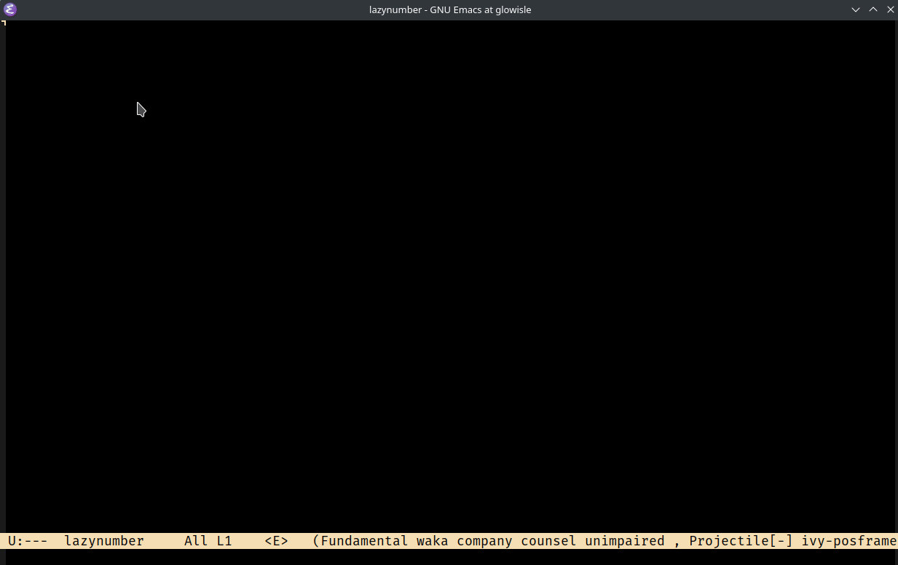

# Lazy Numbers

<div style="text-align=center">

</div>

Enter Numbers without moving your hands off the home row!!!



## Install

### MELPA:

```
M-x package-install lazy-numbers
```

## use-package

```elisp
(use-package lazy-numebrs
    :ensure t)
```

### Manual installation

```elisp
(add-to-list 'load-path "/path/to/lazy-numbers/")
(require 'lazy-numbers)

(global-set-key (kbd "C-'") #'lazy-number-enter)
```

### Usage

Press `C-'` to enter **home-row number input mode**, then use

```
a s d f g h j k l ;
1 2 3 4 5 6 7 8 9 0
```

Press `ESC` to exit.


## About

